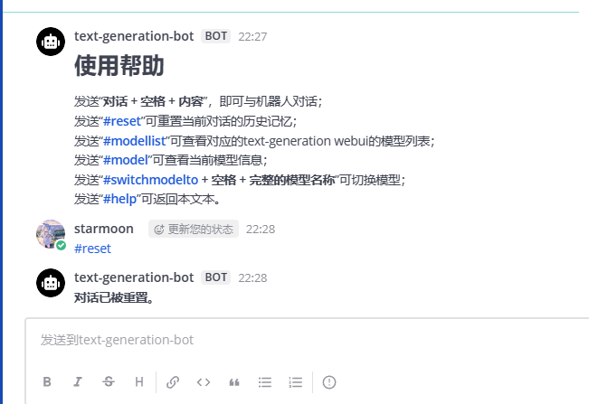

# 基于text-generation webui的mattermost聊天机器人

这是一个用于与text-generation webui的API对接的mattermost机器人。使用了 [mmpy_bot](https://github.com/attzonko/mmpy_bot)框架。
可以在mattermost上实现与AI大预言模型的直接对话。借助text-generation webui的model API，可以使用对话确认模型列表与信息，切换模型。

## 安装要求

基于我的开发环境```Python3.10```。同时，你需要获取mattermost服务器上的至少一个机器人账户的token和text-generation的API URL地址。

## 安装过程

1. 下载项目，并在目录下创建一个虚拟环境（推荐）；
2. 在项目目录下，虚拟环境中执行```pip install -r requirements.txt ```；
3. 修改```tgapi.py```中的tgwebui api地址、角色卡和生成设置（tgwebui的角色卡位于```text-generation-webui\characters```目录下，提示词位于```text-generation-webui\characters\instruction-following```目录下）。
4. 修改```mybot.py```中的mattermost URL地址和机器人账户token；
5. 执行```python mybot.py```启动机器人。
6. 在与机器人交流的对话框中输入```*help```查看使用帮助
## 截图




## 参考资料
https://github.com/oobabooga/text-generation-webui

https://github.com/attzonko/mmpy_bot

https://mmpy-bot.readthedocs.io/en/latest/plugins.html
